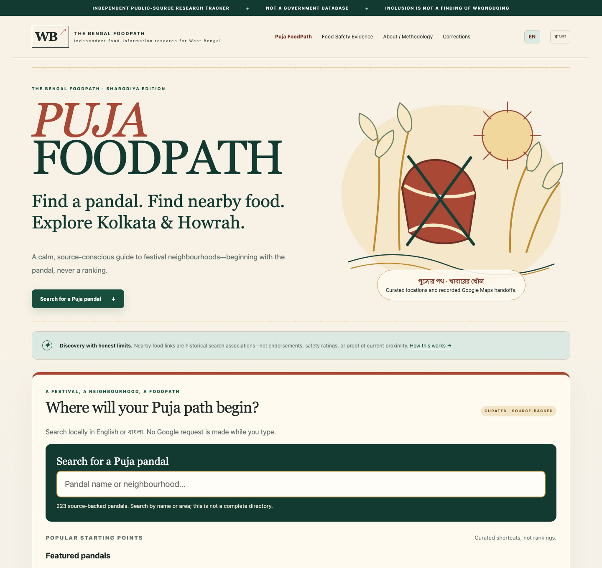

# The Bengal FoodPath

Independent food-information research for West Bengal.

**PUBLIC BETA · Static site · Python 3.12 · MIT code · No project tracking**

### [Explore Puja FoodPath →](https://foodsafety.nemoneek.com/)

[Food Safety Evidence](https://foodsafety.nemoneek.com/?module=safety) · [বাংলায় দেখুন](https://foodsafety.nemoneek.com/?lang=bn) · [Methodology](METHODOLOGY.md) · [Corrections](https://foodsafety.nemoneek.com/corrections.html)

> Independent public-source research. **Not a government database. Inclusion is not a finding of wrongdoing.** Nearby restaurant links are not endorsements or safety ratings. Source verification means the cited source supports the displayed statement; it does not mean the project independently established the event as fact.

## What this is

The Bengal FoodPath brings together two distinct experiences for West Bengal:

- **Puja FoodPath**, the primary seasonal experience: search source-backed pandal listings, explore festival geography, and follow nearby restaurant links to Google Maps.
- **Food Safety Evidence**, the research module: inspect source-linked reporting, geographic context, publication history, corrections and evidence methodology.

Restaurant discovery and inspection reporting remain separate. Proximity never establishes a restaurant's safety or a connection to an inspection record.

> **Help keep FoodPath useful.** Volunteer maintainers are welcome for Bengali/English source review, pandal curation, data validation and open-data tooling. [Volunteer / contribute →](CONTRIBUTING.md)

## Puja FoodPath

Search locally by English or Bengali name, alias, area, neighborhood or city. A small set of featured pandals offers curated shortcuts, not rankings. Search works without coordinates; only independently located entries appear as map markers.

Select a pandal to read its source, listing year and available restaurant links. Records without independently curated restaurant names use “Restaurant on Google Maps.” The source directory's broad Kolkata/Howrah zones can include surrounding districts. Historical listings do not confirm this year's venue or hours.

## Food Safety Evidence

[Open the evidence module](https://foodsafety.nemoneek.com/?module=safety) for records, source links, filters, charts and corrections. Unknown information stays unknown. Counts describe indexed reporting, not prevalence, wrongdoing, compliance or official totals.

## Current experience

The preview shows the current development release; it contains the locally hosted Sharodiya hero supplied for this project and local data, with no captured Google map imagery. The optimized website asset is `site/assets/puja/puja_hero.webp`; its development source and usage note are retained under [`docs/assets/`](docs/assets/ASSET_PROVENANCE.md).

## How Puja discovery works

Curated public sources → bounded retrieval → structured extraction and source review → verified catalog → local search.

Gemini assists with extracting candidate facts and exact evidence spans. It cannot invent pandals, translations or coordinates and cannot directly publish the pandal catalog. Already structured source tables can be curated directly. The reviewed configuration is the publication boundary. [Curation and refresh details](docs/PUJA_CURATION.md).

Restaurant discovery is separate: reviewed zones → bounded saturation-aware Nearby
Search → dedupe by place ID → temporary coordinate matching → durable associations
and Google Maps links.

Place IDs are durable. Google-derived coordinates expire in ignored storage, within 30 days; Google names, raw responses and coordinates do not enter permanent public data. [Places architecture](docs/PLACES.md).

## How evidence works

Public reporting → bounded retrieval → LLM structured candidates → source-grounded schema, evidence, duplicate and safety validation → publish or skip.

Fully validated Food Safety candidates may publish automatically. Ambiguous or unsupported candidates do not. Source evidence remains authoritative. There is no chatbot, public Q&A, training or fine-tuning.

Previously published records can carry source-availability warnings while technical failures are retried. Material uncertainty, corrections and withdrawals change publication eligibility; prolonged unverifiability moves records out of active analytics. History remains visible. [Methodology](METHODOLOGY.md) · [LLM extraction](docs/LLM_EXTRACTION.md).

## Maps and cost-aware operation

The initial page serves local data and an accessible geographic summary. **Open live Google map** is an explicit choice on each fresh visit. The loader reuses one map for selection and layer changes; no Google map tiles or imagery are stored for offline reuse.

- Zero visitor-triggered Places calls.
- Places discovery is explicit/operator-side, with a 3,000-attempt monthly internal
  cap and a 60-attempt per-run ceiling. Saturated searches may use up to three
  deterministic supplemental circles; dry-run planning exposes the full bound first.
- Dynamic Maps loads are billed separately and have no project-side monthly ledger.
- Separate API keys serve browser visualization and private server discovery.
- Restricted referrers, Maps API restrictions and a conservative Google Cloud map-load quota mitigate abuse. QPM limits and billing alerts are not a monthly cost ceiling.

[Browser-key setup, quota steps and deployment input](docs/BROWSER_MAP.md). The optional map needs the existing build environment to supply its restricted browser key; the fallback remains fully functional without it.

## Current coverage

Snapshot: **2026-09-16**.

| Dataset | Coverage |
| --- | --- |
| Source-backed pandal catalog | 223 listings: 183 Kolkata-zone, 40 Howrah-zone |
| Map-ready pandals | 14 independently sourced anchors; other listings remain searchable without markers |
| Pandal sources / featured shortcuts | 4 source URLs / 6 featured entries |
| Restaurant discovery | 296 unique place IDs / 464 historical radius associations across 14 pandals |
| Active Food Safety Evidence | 48 records, 37 area labels, 19 sources |

This is not a complete Puja directory. Most new entries are grounded in one directory's 2025 tables; broader independent and Bengali source coverage remains limited.

Current counts come from [pandal JSON](https://foodsafety.nemoneek.com/data/pandals.json), [evidence JSON](https://foodsafety.nemoneek.com/data/events.json) and [CSV](https://foodsafety.nemoneek.com/data/events.csv). The live site reflects these changes after the release merge.

## Automatic refresh

**Refresh Food Safety Data** runs approximately every two hours. Within it, Puja source research is due every six hours by default, with a hard configuration maximum of ten runs/day. Revision receipts prevent repeated Gemini calls for unchanged Puja sources, including on fresh runners. The Puja catalog rebuild publishes only reviewed configuration; scheduled research candidates remain private and ephemeral.

There is no scheduled all-zone Places sweep, public refresh endpoint, or Google map prefetch. Schedules are best-effort. [Maintainer guide](docs/MAINTAINER_GUIDE.md).

## Run locally

Use the existing project environment:

~~~bash
conda activate "$(pwd)/.conda/envs/food"
python -m food_safety.cli validate
python -m food_safety.cli build
python -m http.server 8000 --bind 127.0.0.1 --directory site
~~~

Open http://127.0.0.1:8000/. Copy blank placeholders from `.env.example` into an ignored local `.env` as needed; never commit key values. Browse without credentials using the fallback. Model and Places calls are bounded operator actions.

~~~bash
python -m food_safety.cli puja stats
python -m food_safety.cli places discover --dry-run
python -m ruff check .
python -m pytest -q
node --test tests/*.test.mjs
python scripts/verify_public_output.py
~~~

[Environment setup](scripts/setup_food.sh) · [Puja CLI](docs/PUJA_CURATION.md) · [Places CLI](docs/PLACES.md).

## Architecture

| Location | Purpose |
| --- | --- |
| `src/food_safety/` | Retrieval, extraction, evidence validation, lifecycle and exports |
| `config/puja.yml` | Reviewed pandal catalog and bounded research sources |
| `config/places.yml` | Curated pandals/zones and explicit Places budgets |
| `data/` | Versioned public structured data |
| `site/` | Static HTML, native JavaScript/CSS and local assets |
| `.github/workflows/` | CI and bounded refresh |

JSON/CSV remain canonical; there is no database server, vector store or frontend framework. Production uses the existing Cloudflare static-assets integration. Work goes to `develop`; release uses a merge commit into `main`.

## Security and privacy

No project tracking, public write API, accounts, comments, uploads or ratings platform. Optional Google Maps receives provider network information only after the user chooses to load it. Hosting and Google privacy policies apply.

Private source snapshots, model candidates, caches, operational ledgers and credentials are excluded from Git and public output. Source retrieval uses URL/DNS/robots controls and response limits. Public rendering uses safe text APIs and a restricted CSP.

[Security](SECURITY.md) · [Privacy](PRIVACY.md) · [Repository audit](docs/PUBLIC_REPOSITORY_AUDIT.md) · [Deployment](docs/DEPLOYMENT.md).

## Contributing

Read [CONTRIBUTING.md](CONTRIBUTING.md) and the [Code of Conduct](CODE_OF_CONDUCT.md). Help verify sources, correct records, curate pandals or improve Bengali coverage. Contributions do not bypass evidence rules. Private-response community intake is prepared through a configurable Google Form; no unconfigured form or fabricated queue count is displayed.

## Disclaimer and licensing

**Project policy wording is not legal advice. Independent legal review has not been completed.** Read the full [disclaimer](DISCLAIMER.md) and preserve source links and limitations when reusing data.

Project code is [MIT licensed](LICENSE). Third-party content and trademarks remain subject to their respective rights. News excerpts and geographic materials are not relicensed as project-owned content. Compiled factual data does not imply ownership of source facts.

Created and maintained by **Shubhabrata Mukherjee** ([@shubha07m](https://github.com/shubha07m)).

© 2026 Shubhabrata Mukherjee · The Bengal FoodPath.

## Professional independence

The Bengal FoodPath is a personal, independent project created and maintained by Shubhabrata Mukherjee. It is not affiliated with, sponsored by, endorsed by, or produced on behalf of Lawrence Berkeley National Laboratory (Berkeley Lab), the University of California, the U.S. Department of Energy, or any current or former employer or professional affiliation of the maintainer. The views, data curation, software, analysis, and project decisions are solely those of the project maintainer and contributors, as stated, and do not represent those organizations. Third-party source content and trademarks remain subject to their respective rights.
