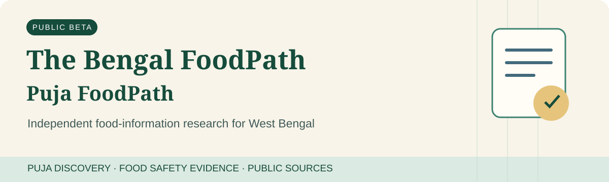
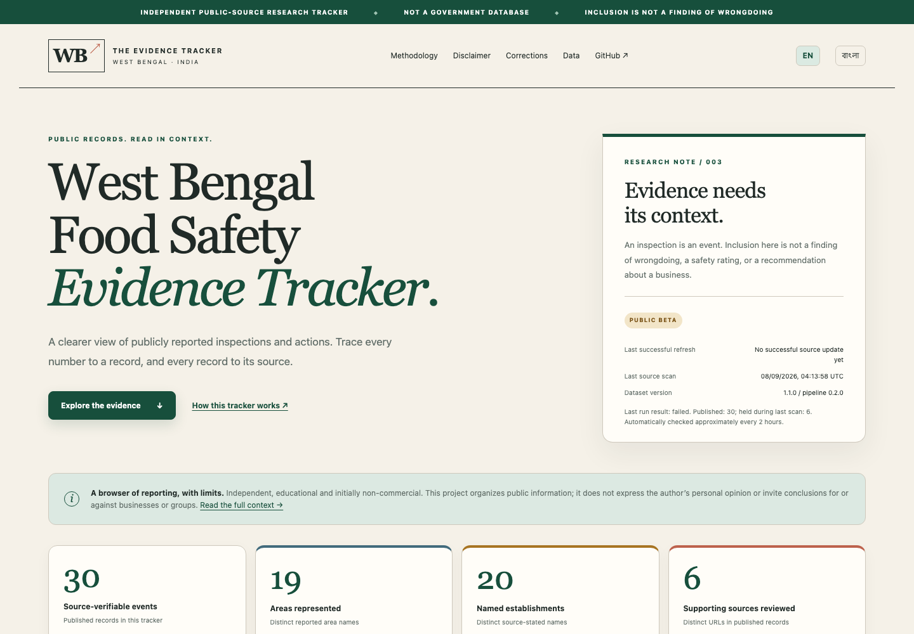
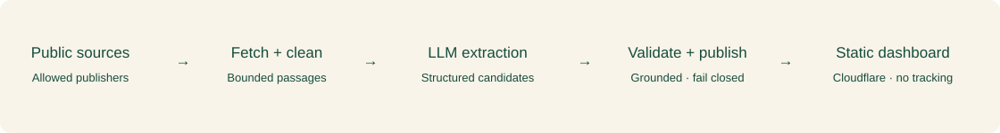

# The Bengal FoodPath

Independent food-information research for West Bengal.

Current module: **Food Safety & Inspection Evidence** (West Bengal Food Safety Evidence Tracker).



[](https://github.com/shubha07m/food_safety/actions/workflows/ci.yml)
**PUBLIC BETA · Python 3.12 · Static site · Cloudflare · MIT code · No tracking**

> Independent public-source research. **Not a government database. Inclusion is not a finding of wrongdoing.** Source verification means the cited source supports the displayed statement; it does not mean the project independently established the event as fact.

### [Explore the live tracker →](https://foodsafety.nemoneek.com/)

[বাংলায় দেখুন](https://foodsafety.nemoneek.com/?lang=bn) · [Methodology](METHODOLOGY.md) · [Disclaimer](DISCLAIMER.md) · [Data](https://foodsafety.nemoneek.com/data.html) · [Corrections](https://foodsafety.nemoneek.com/corrections.html) · [Contribute](CONTRIBUTING.md)

## What this is

A public-interest, educational and academic data-research project organizing publicly reported food-safety inspection events in West Bengal, initially Kolkata and nearby areas. Every published fact links to source evidence; every chart reveals the records behind its count.

This is not a blacklist, safety rating, official total, accusation platform or opinion-building project. It does not infer social/community identity or recommend patronizing or avoiding any business. Unknown information is shown, not guessed.

> ### 🤝 Help keep the tracker useful
>
> Volunteer maintainers are welcome for source review, Bengali/English coverage, data validation and open-data tooling. Evidence and safety standards apply to every contribution.
>
> **[Volunteer / Contribute →](CONTRIBUTING.md)** · No personal information is collected on this website.

## Dashboard preview



Native SVG charts, source-linked records, combined filters, field completeness and missingness. The local West Bengal basemap uses coarse reviewed area anchors—not establishment addresses, incident density or risk.

## How it works



Public sources → bounded retrieval → exact evidence validation → safety checks and deduplication → structured record → interactive dashboard. Failed or ambiguous candidates do not become public records.

## Current coverage

The live dashboard computes its own totals from the [published JSON](https://foodsafety.nemoneek.com/data/events.json), with a matching [CSV export](https://foodsafety.nemoneek.com/data/events.csv). The initial sample is small and concentrated in a few publishers. Cross-source verification and contextual coverage remain limited. See [dataset quality](reports/v2_dataset_quality_report.md); its dated snapshot is not a live total.

Counts describe indexed reporting, **not prevalence, compliance, authority activity or wrongdoing**. Prototype values and test fixtures never enter production data.

## Automatic updates

**Refresh Food Safety Data** is scheduled approximately every two hours (`17 */2 * * *`) and can be run manually in GitHub Actions. Schedules are best-effort, not a freshness guarantee.

The workflow draws from bounded publisher indexes, RSS/Atom feeds, configured sitemaps, curated URLs and approved community leads. It can discover up to 80 unique URLs and processes at most 20 new/due articles per run, with separate discovery and revalidation budgets and per-host circuit breaking. An optional Brave Search API adapter is disabled unless a maintainer explicitly configures it. New English/Bengali candidates require explicit supported inspection statements and all source, schema and safety gates. Ambiguous new records never publish. See the current [source coverage report](reports/source_coverage.md).

Previously published records receive dated access warnings for technical failures, not automatic evidence-failure suspensions. Semantic uncertainty leaves active analytics; 30 days without adequate revalidation leads to an unverifiable archive. Restoration preserves first-publication history. See [the detailed lifecycle](METHODOLOGY.md).

Public metrics distinguish Active, Ever published, warning and non-active states. These overlap and must not be added together. Private-response community intake is prepared through a configurable Google Form; no fake form URL or community queue count is displayed. A URL-only **Licensing & Compliance Documents** schema is a manually reviewed pilot with no published documents or quality endorsements. Language, source/revision IDs and field support prepare future research without adding AI, embeddings or a database.

Only approved public artifacts are committed to `main`; Cloudflare Git integration redeploys `site/`. No change means no empty commit. The workflow has no push trigger, so its generated commits cannot recursively start another source scan. Failed scans never advance the last-successful timestamp. Maintainers periodically audit a few new records.

Ordinary visitors have no refresh endpoint. Maintainers use **Actions → Refresh Food Safety Data → Run workflow**. [Short maintainer guide](docs/MAINTAINER_GUIDE.md).

## Evidence standards

`reported_fact` and `derived_context` are structurally separate. Exact short source spans support factual fields. Non-default contextual categories need evidence, method, confidence and maintainer review. `SOURCE VERIFIED` is about source support, not independently proven truth. Automatic validation has explicit provenance and never impersonates human review.

[Data dictionary](DATA_DICTIONARY.md) · [Source policy](SOURCES.md) · [Methodology](METHODOLOGY.md) · [Corrections](CORRECTIONS.md)

## Bengali support

Use **EN | বাংলা** or [`?lang=bn`](https://foodsafety.nemoneek.com/?lang=bn). Navigation, principal dashboard labels, charts, filters and policy summaries have static Bengali translations. Full policies are also available in English. The original English/Bengali source quotations remain unchanged and clearly labeled; UI translations are not evidence. No translation API, external font or tracking cookie is used.

Narrow Bengali ingestion now recognizes explicit authority/location/inspection constructions. It is not general Bengali language understanding: negation, ambiguous entities and unsupported structures remain pending. Discovery is bounded and publisher access restrictions are respected.

Created and maintained by **Shubhabrata Mukherjee** ([@shubha07m](https://github.com/shubha07m)).

© 2026 Shubhabrata Mukherjee · The Bengal FoodPath. Independent public-interest data project. Project code is MIT-licensed where stated. Third-party content and trademarks remain subject to their respective rights.

## Run locally

```bash
git clone https://github.com/shubha07m/food_safety.git
cd food_safety
bash scripts/setup_food.sh
conda activate "$(pwd)/.conda/envs/food"
python -m food_safety.cli build
python -m http.server 8000 --bind 127.0.0.1 --directory site
```

An existing local `food` environment can be reused. Python execution and dependencies stay in that environment. For an explicitly bounded local refresh: `AUTO_PUBLISH=true python -m food_safety.cli update --max-articles 3`. Transport failures create warnings rather than evidence suspensions; inspect every resulting diff.

## Architecture

### Structured extraction, with independent publication checks

The language model proposes structured candidate records from source documents. Candidates that satisfy all source-grounding, schema, semantic, and safety checks may be published automatically. Ambiguous or higher-risk cases are held for human review; invalid claims are rejected. Unsupported optional fields can be omitted without discarding supported core facts.

Deterministic extraction remains active alongside the bounded multilingual extractor. LLM-derived candidates may publish only after the same source-grounding, semantic, safety and publication gates as every other candidate; ambiguous candidates remain private exceptions. Missing credentials or model failures leave deterministic ingestion and existing source lifecycle states unaffected. Use [LLM extraction and diagnostics](docs/LLM_EXTRACTION.md) for bounded testing.

Original source evidence remains authoritative. There is no chatbot, public Q&A, model training, fine-tuning or autonomous source-independent factual generation. Model assistance is not a trust score or a marketing claim.

| Component | Responsibility |
| --- | --- |
| `src/food_safety/` | Bounded retrieval, schemas, evidence validation, publication, exports |
| `config/` | Explicit source whitelist and hard request limits |
| `data/events.json` | Versioned approved research dataset |
| `site/` | Only public deployment output; native JS/SVG, local assets |
| `tests/` | Synthetic deterministic regression fixtures; no paid APIs |
| `.github/workflows/` | CI and bounded two-hour refresh |

Private pending/rejected queues, local article downloads, source snapshots and browser profiles are excluded from commits. Minimal suspension tombstones preserve stable record status without republishing held claims. Local branch history has been sanitized; repository visibility remains private until GitHub removes retained server-side pull-request refs documented in the [current audit](docs/PUBLIC_REPOSITORY_AUDIT.md).

## Security and privacy

No public database, write API, accounts, comments, uploads, ad trackers, analytics or runtime third-party scripts. HTTPS, CSP, framing restrictions, safe link rendering, SSRF-aware retrieval and response caps remain in place. The map is locally bundled, with [attribution](site/assets/BASEMAP_LICENSE.md). Hosting providers may process operational logs under their own policies.

[Security](SECURITY.md) · [Privacy](PRIVACY.md) · [Deployment](docs/DEPLOYMENT.md) · [Public repository audit](docs/PUBLIC_REPOSITORY_AUDIT.md)

## Validate changes

```bash
ruff check .
pytest --basetemp=.cache/pytest
node --test tests/*.test.mjs
python -m food_safety.cli validate
python -m food_safety.cli build
python scripts/verify_public_output.py
```

The optional browser smoke uses an already-installed Chrome; no browser bundle is downloaded. Tests mock model responses and never consume paid API tokens. VLM remains disabled. Source submissions and Issues never publish automatically.

With the local server running, `node scripts/browser_smoke.mjs` checks the real and
synthetic UI without modifying public assets. Set `FOOD_UPDATE_PREVIEWS=1` for an
explicit refresh of the small README screenshot and social preview PNG.

## Contributing and volunteer maintainers

Read [CONTRIBUTING.md](CONTRIBUTING.md) and the [Code of Conduct](CODE_OF_CONDUCT.md). Suggest a public source, request a correction, help audit evidence, improve Bengali wording or maintain the tooling. Controlled GitHub Issue Forms become publicly accessible when the maintainer makes the repository public. Until then, access requires a repository invitation.

## Disclaimer and licensing

**Project policy wording is not legal advice. Independent legal review has not been completed.** This project does not promise legal immunity. Preserve source links and interpretation notices when sharing; third-party commentary does not represent the project. See the full [disclaimer](DISCLAIMER.md).

Code is [MIT licensed](LICENSE). Third-party news content and geographic data are not relicensed by that license. Evidence excerpts retain their original rights; research data reuse must preserve attribution, limitations and applicable third-party rights.

## Professional independence

The Bengal FoodPath is a personal, independent project created and maintained by Shubhabrata Mukherjee. It is not affiliated with, sponsored by, endorsed by, or produced on behalf of Lawrence Berkeley National Laboratory (Berkeley Lab), the University of California, the U.S. Department of Energy, or any current or former employer or professional affiliation of the maintainer. The views, data curation, software, analysis, and project decisions are solely those of the project maintainer and contributors, as stated, and do not represent those organizations. Third-party source content and trademarks remain subject to their respective rights.
