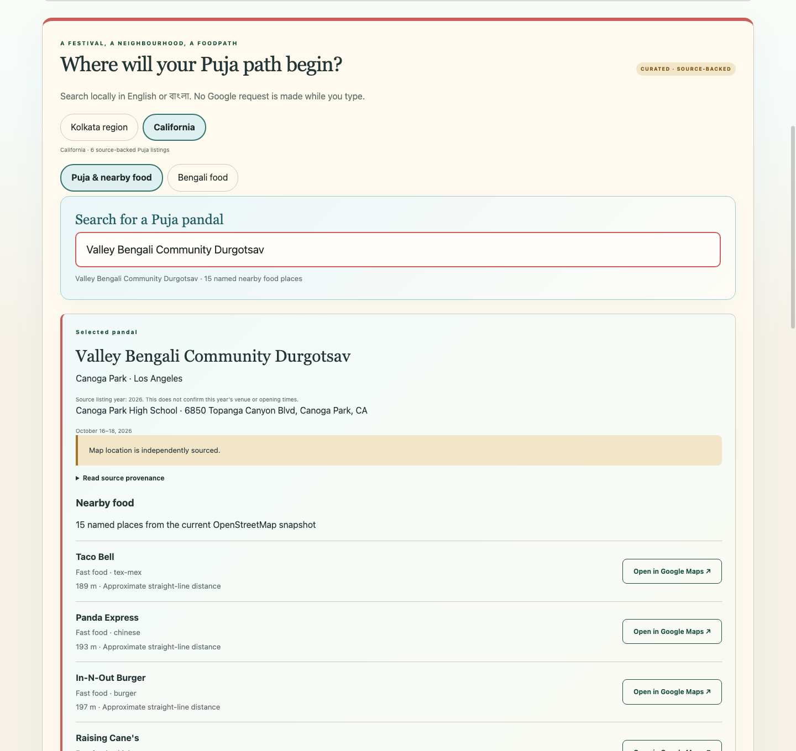

# The Bengal FoodPath

**Find a Puja. Find nearby food. From Kolkata to California.**

A source-conscious, static-first food and festival discovery project originating
in Bengal and extending to Bengali communities beyond Bengal.

[Explore Puja FoodPath](https://foodsafety.nemoneek.com/) ·
[California](https://foodsafety.nemoneek.com/?region=california) ·
[বাংলা](https://foodsafety.nemoneek.com/?lang=bn) ·
[Food Safety Evidence](https://foodsafety.nemoneek.com/?module=safety)

> Independent and non-governmental. Nearby food is not a recommendation, inspection,
> or safety rating. Food Safety Evidence is a separate West Bengal research module:
> inclusion is not a finding of wrongdoing, and source support is not independent
> proof of an event.

## Two distinct experiences

**Puja FoodPath** is the primary seasonal experience, beginning with the **Kolkata
region** and **California**. Search source-backed Puja listings, explore reviewed
geographic anchors, browse named nearby food, and open Google Maps when useful.
“The Bengal” describes the project's origin and cultural context, not a promise
of worldwide coverage.

**Food Safety Evidence** remains **West Bengal only**. It organizes source-linked
reporting, original evidence, reporting geography, publication history and corrections.
California food discovery does not create California inspection coverage or connect
restaurants to West Bengal evidence.

## Current experience

These development-release previews use local static data and no captured Google
map imagery. [Artwork and screenshot provenance](docs/assets/ASSET_PROVENANCE.md).

## Discover a Puja and nearby food

- Choose a region; search locally by name, sourced alias, neighbourhood, area or city.
- Featured Pujas are curated shortcuts with reviewed geography and meaningful named
  food coverage, never rankings. There are at most six per region.
- Select a Puja to browse up to 20 named food places, initially 12. Ordering is by
  approximate straight-line distance, then name and stable ID—not quality.
- Food names and optional cuisine/category tags come from OpenStreetMap. Anonymous
  historical Google associations remain retained but are not individual public rows.
- Sparse mapped catchments offer one neighbourhood-search handoff. Unmapped listings
  remain searchable without invented proximity results.
- California also offers **Bengali food** shortcuts for the Bay Area, Southern
  California, Sacramento and all California. These open regional Google Maps searches;
  they are not a verified restaurant directory or additional food POIs.

Historical listings and map anchors do not establish current-year entrances, hours,
accessibility, walking routes or business availability. Check organizers and venues.

## How discovery works

~~~text
Public Puja sources → reviewed catalog and geographic anchors
Regional food snapshots → normalized provider-neutral POIs
                       → local grid/Haversine association
                       → static named nearby-food results
                       → keyless Google Maps handoff
                       + optional verified Google identity crosswalk
~~~

**Kolkata uses hybrid discovery:** OSM names and local associations alongside retained
Google discovery/enrichment data. **California currently uses OSM** for nearby-food
lists, with optional operator-side Google identity suggestions. OSM has not replaced
Google everywhere; coverage differs substantially by region.

A verified Google place ID takes precedence in the handoff. Otherwise the URL targets
the OSM latitude/longitude directly, avoiding a broad chain-name search. A coordinate
pin is not a claim of exact Google business identity. ID-only search suggestions cannot
verify that identity by themselves and never publish automatically.

Gemini assists bounded source extraction, not identity matching or coordinate invention.
Puja publication requires reviewed source-backed configuration. Full technical details:
[Food POIs](docs/FOOD_POIS.md) · [Puja curation](docs/PUJA_CURATION.md) ·
[Google provider](docs/PLACES.md).

## Coverage snapshot

Development data checked **2026-09-19**; the live site changes after release.

| Dataset | Kolkata region | California |
| --- | --- | --- |
| Source-backed Puja listings | 223 | 6 |
| Reviewed map anchors | 14 | 4 |
| Normalized OSM food POIs | 652 | 263 retained regional catchment POIs |
| Named OSM POIs | 618 | 246 |
| Distinct named associated food places | 63 | 72 |
| OSM snapshot | 2026-09-16 | 2026-09-18 |

These are snapshot counts, not complete directories. Overlapping Puja catchments can
share food places. Many Kolkata listings come from 2025 directory rows; California
uses organizer sources for 2026. Only independently located Pujas receive spatial
associations. Featured counts and available lists are generated from current coverage.

Food Safety Evidence currently contains **48 active published records**, **36 area
labels** and **19 source URLs**. These measure indexed reporting, not incidence or
official inspection totals. [Public data](https://foodsafety.nemoneek.com/data/events.json)
and [methodology](METHODOLOGY.md) provide context.

## Maps, APIs and privacy

Visitors make **zero Google Places API calls and zero OSM API calls**. Food lists,
search and geographic summaries read precomputed static JSON.

The optional **Open live Google map** action loads Maps JavaScript separately.
Region switches, markers and layers reuse one map instance. Ordinary Google Maps
links navigate to Google; no application API request is needed to construct them.

Google operator calls have a shared 3,000-attempt monthly internal ceiling, per-run
limits, retry accounting and dry runs. Maps JavaScript billing is separate and has
no project-side monthly ledger. No Google tiles or map imagery are stored for reuse.
[Browser configuration and cost controls](docs/BROWSER_MAP.md).

There is no project analytics, tracking, account system, public write API or visitor
database. Hosting and external-provider policies still apply.
[Privacy](PRIVACY.md) · [Current controls](SECURITY.md).

## Food Safety evidence workflow

Public reporting → bounded retrieval → LLM structured candidates → objective source,
schema, evidence, duplicate and publication validation → publish or skip.

Original evidence stays authoritative. Unsupported candidates are skipped; later
corrections, withdrawals and availability changes follow the existing lifecycle.
There is no chatbot, model training or fine-tuning. Source verification does not
establish real-world truth. [Evidence methodology](METHODOLOGY.md) ·
[Corrections](CORRECTIONS.md) · [Extraction](docs/LLM_EXTRACTION.md).

## Run locally

~~~bash
# Existing project environment; scripts/setup_food.sh provides initial setup.
conda activate "$(pwd)/.conda/envs/food"
python -m food_safety.cli validate
python -m food_safety.cli build
python -m http.server 8000 --bind 127.0.0.1 --directory site
~~~

Open http://127.0.0.1:8000/ or add `?region=california`, `?lang=bn`, or
`?module=safety`. Tracked `site/maps-config.json` is deliberately blank.
**An ordinary local static server shows the live-map fallback, even with a local
.env file.** This is expected. Use the isolated deployment-artifact procedure in
[BROWSER_MAP.md](docs/BROWSER_MAP.md) for deliberate live-map testing; never populate
the tracked configuration.

~~~bash
python -m food_safety.cli osm --region california stats
python -m food_safety.cli osm --region california associate
python -m food_safety.cli osm --region california resolve-google --dry-run
python -m ruff check .
python -m pytest -q
node --test tests/*.test.mjs
python scripts/verify_public_output.py
~~~

Normal builds do not download snapshots or call Places. Real imports and enrichment
are explicit operator actions, separate from visitors and scheduled evidence updates.

## Structure and maintenance

| Path | Purpose |
| --- | --- |
| `config/regions.yml` | Region registry, static food-search shortcuts and provider paths |
| `config/puja*.yml` | Reviewed Puja records, sources and geographic provenance |
| `config/food*.yml` | Regional OSM settings and optional identity crosswalk |
| `config/places.yml` | Retained Google zone discovery and budgets |
| `src/food_safety/` | Evidence pipeline, Puja curation and provider-neutral food processing |
| `data/` → `site/data/` | Validated static public datasets |
| `site/` → ignored `dist/site/` | Tracked static source → configured deployment artifact |

No database server or frontend framework is required. Scheduled evidence refresh is
bounded; Puja research is due roughly four times/day, without an automatic Places
sweep. `develop` is implementation; `main` is production. Releases use owner-approved
merge commits. [Maintainer guide](docs/MAINTAINER_GUIDE.md) ·
[Deployment](docs/DEPLOYMENT.md) · [Repository audit](docs/PUBLIC_REPOSITORY_AUDIT.md).

## Contribute

Help verify Puja sources, California/community venues, coordinates, Bengali/English
wording, OSM data or identity corrections. Evidence corrections remain a separate
source-grounded process. Read [CONTRIBUTING.md](CONTRIBUTING.md) and the
[Code of Conduct](CODE_OF_CONDUCT.md). No submission automatically publishes.

## Rights and limitations

- Software/code: [MIT](LICENSE), unless otherwise stated.
- OSM-derived data: **ODbL-1.0, © OpenStreetMap contributors**; see
  [OSM copyright](https://www.openstreetmap.org/copyright).
- Google identifiers/content: applicable Google terms, not project-owned data.
- Original project artwork/content: applicable ownership and asset-specific statements.
- Third-party reporting, quotations and trademarks are **not relicensed as MIT**.

This is public-interest discovery and research, not travel assurance, official records
or advice to patronize or avoid businesses. Policy wording is not legal advice;
independent legal review remains outstanding. [Full disclaimer](DISCLAIMER.md).

## Professional independence

Created and maintained by **Shubhabrata Mukherjee** ([@shubha07m](https://github.com/shubha07m)).
The Bengal FoodPath is a personal, independent project. It is
not affiliated with, sponsored by, endorsed by, or produced on behalf of
Lawrence Berkeley National Laboratory (Berkeley Lab), the University of California, the U.S. Department of Energy,
or any current or former employer or professional affiliation of the maintainer.
Project decisions and views belong to the maintainer and contributors, not those
organizations. Third-party content and trademarks remain subject to their respective rights.

© 2026 Shubhabrata Mukherjee · The Bengal FoodPath.
